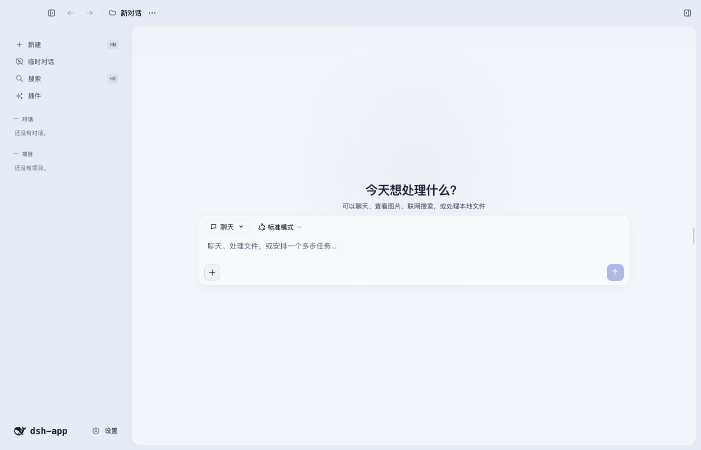
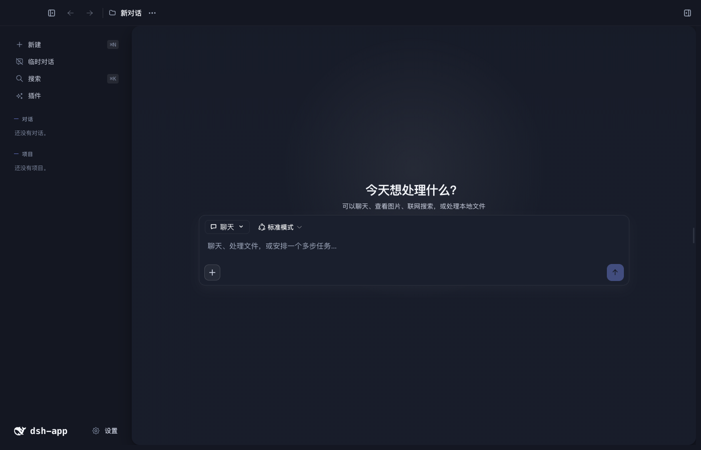

# DeepSeek Harness Desktop App

[中文](README.md) | English

> [View the anime README variant](README.anime.md)

[](https://dshfind.com/en/plugins/vibeinging/deepseek-harness-desktop-app?ref=badge)

DeepSeek Harness Desktop App is a local AI work desktop built on DeepSeek Harness (DSH). It brings DSH Sessions, Agents, Tools, Skills, MCP, and Profile Bundles together with projects, files, web pages, Git Worktrees, Canvas, Sites, and Office artifacts in one desktop application.

| Professional blue, light | Professional blue, dark |
| --- | --- |
|  |  |

## Quick start

Local development requires Node.js 24 or later. The project currently uses DSH `0.1.0-rc.6`.

```bash
npm install
npm run doctor
npm run dev
```

Run `npm run setup` after changing the Node.js major version, CPU architecture, or operating system.

## Main features

| Feature | What users can do |
|---|---|
| DSH conversations | Stream answers, inspect reasoning and tool calls, stop, continue, retry, branch messages, and restore after restart |
| Models and permissions | Select a provider, model, and reasoning level; manage credential references, Session permissions, tool approvals, and model questions |
| Tools, Skills, MCP, and multi-Agent | Use Tools, Skills, MCP servers, Hooks, sub-Agents, and Workflows loaded by the current Profile |
| Projects and conversations | Create project, global, or temporary conversations; pin, reorder, rename, archive, restore, and delete |
| Desktop shell and settings | Use a three-column workbench, collapse either side, search globally, use zoom shortcuts and update checks, and configure language, network, notifications, terminal, and privacy options |
| Project context and memory | Configure application and project instructions, authorized source roots, write targets, and global or project memory |
| Input and references | Reference files with `@`, conversations with `#`, and attach images or large pasted text |
| Coding workspace | Inspect Diff, comment or edit by line, open files in an external editor, start AI Review, and safely revert model-made file changes |
| Git Worktrees | Create, activate, deactivate, and remove isolated working directories, then run new conversations in the selected Worktree |
| Files and search | Browse project, task, and artifact files; preview text, code, images, and Office content; search names or contents |
| Browser Workspace | Use multiple tabs, history, find-in-page, zoom, downloads, print, developer tools, site permissions, page snapshots, and “Use this page” |
| Results and evidence | Inspect the current DSH Session trajectory, tool inputs and outputs, timing, Token usage, and final answer |
| Canvas and local Sites | Create and edit Canvas content, handle inline suggestions and version conflicts, and build responsive single-file Sites |
| Office artifacts | Create, inspect, and precisely edit Markdown, DOCX, XLSX, PPTX, and PDF artifacts while preserving versions |
| Themes and appearance | Switch Profile themes; create, import, preview, edit, export, and delete local themes; adjust mode, background, and transparency |
| Plugin Center | Check compatibility, install DSH Profile Bundles into the current Web Profile, and inspect their source, version, and order |

## The DSH trajectory is the result and evidence

The right-side Results and evidence view reads the bound DSH Session's `session.history` directly. User messages, request context, model output, tool calls, tool results, permission changes, and final answers stay in one replayable trajectory without a second run center.


## Conversations and workbench

One project conversation maps to one DSH Session. The right-side workbench can show Results and evidence, browser, files, artifacts, and Sites. The project file tree, Agent working directory, current Diff, and line editing follow the current project permissions and active Worktree.


Canvas keeps immutable versions and supports content editing, version comparison, exact inline suggestions, and conflict handling. Sites use the same version model and provide desktop, tablet, and mobile previews in an isolated sandbox.


## Isolated development with Git Worktrees

Project settings provide a complete Worktree workflow:

1. Create one or more independent branches and working directories for a project, with one active at a time.
2. New conversations use the active Worktree for the Agent, DSH Session, Diff, and line editing while the main checkout stays unchanged.
3. Switching working directories does not move existing conversations. Activate the target Worktree before creating a conversation.
4. Switch back to the main checkout before removal. Removing the working directory keeps its Git branch to avoid deleting commits.
5. Non-Git directories, duplicate branches, out-of-scope paths, and unsafe symlinks are rejected; missing Worktrees are marked unavailable.


## Themes and appearance

The `@deepseek-ai/dsh-theme-pack` Profile Bundle provides the default `professional-blue` and optional `anime-blue` themes. The product also supports creating, importing, previewing, editing, exporting, and deleting local custom themes.

Local themes are restricted to safe color and appearance settings. They cannot inject raw CSS, use remote images, or change the application name. Personal backgrounds, display mode, and transparency remain independently adjustable.


## Plugin Center

Regular users install DSH Profile Bundles from the “Plugins” page:

1. Select a candidate plugin from the built-in community directory, or enter an npm package with an exact version or a GitHub repository URL pinned to a full commit.
2. Run compatibility checks first. Installation becomes available only when the result is “Ready”.
3. Inspect the installed Bundle's source, version, order, and capabilities. User-installed Bundles can be removed.

Host Bundles that provide Tools, Skills, MCP servers, or Hooks can enter the DSH runtime. Bundles containing third-party Client UI do not enter the Electron-privileged main window by default. Only Client Bundles that have passed code review and are pinned to an exact version can enter the current product Renderer; other plugins remain pending until a separate preload-free runtime area is available.


### Community Plugin Directory

The project maintains a machine-readable community plugin directory, and the Plugin Center reads the same data directly. The directory records repositories, version sources, Star snapshots, compatibility status, and adoption priority. Stars indicate community interest only; installation must still pass the Profile preflight and desktop compatibility tests.

| Plugin | Community capabilities | Current adoption plan |
|---|---|---|
| [DSH Plugin Market](https://github.com/dsh-market/dsh-market) | Browse, search, install, and update DSH plugins | Reviewed and integrated into the Profile and Client graphs, pinned to `dshmarket@1.9.0` |
| [dsh-web-ui](https://github.com/zhu1090093659/dsh-web-ui) | Task board, Git graph, real-time statistics, remote UI, pet, and skins | Adopt by subpackage instead of installing the entire suite |
| [modlens](https://github.com/liustack/modlens) | Provide OCR, layout, and semantic evidence from images to text models | Integrate after credential and data transmission review |
| [DSH Better Sidebar](https://github.com/omdsh-dev/DSH-better-sidebar) | Files, editor, terminal, Git, Sub-Agents, and third-party tabs | Wait for a standard Slot or separate runtime area to avoid conflicts with the desktop shell |
| [DSH Vision Toolkit](https://github.com/Anionex/dsh-vision-toolkit) | Image Q&A, OCR, UI reconstruction, pixel differences, and Artifacts | Integrate after the Tool View Slot is available |
| [DSH @file](https://github.com/omdsh-dev/dsh-at-file) | Search and reference workspace files from the input box | Integrate after the input overlay Slot is available |
| [DSH OpenPencil](https://github.com/ZSeven-W/dsh-openpencil) | OpenPencil preview and editing | Use the community implementation instead of developing another one |
| [DSH Files](https://github.com/taxueseek/dsh-files) | File uploads, attachment cards, and document reading | Integrate after standard attachment identity is wired through |
| [DSH Find Plugin](https://github.com/awesome-dsh-plugin/dsh-find-plugin) | Let the Agent search for community plugins | Confirmed as a Host Tool Bundle; the current version needs migration to the rc.6 SDK |
| [DSH Toolkit](https://github.com/omdsh-dev/dsh-toolkit) | Deterministic tools for time, encoding, JSON, CSV, diffs, and statistics | Adopt after pinned Git revision review instead of rebuilding basic tools |
| [Distill](https://github.com/LoserFox/distill) | Reflect on conversations and distill reusable Skills | Integrate after Session, subagent, and Skill lifecycle verification |
| [DSH MCP Bridge](https://github.com/Edge-Echo/dsh-mcp-bridge) | Filesystem, GitHub, Playwright, memory, and remote HTTP MCP | Passed the rc.6 Profile preflight; can be installed after network and process permission review |

Discover the full ecosystem through [Awesome DeepSeek Harness Plugin](https://github.com/awesome-dsh-plugin/awesome-dsh-plugin). The candidate directory is a curated product list, not a copy of all community marketplace data. Compatibility changes should be contributed to community projects first; develop an in-house implementation only when the community has no suitable option.

A DSH plugin is not necessarily a UI plugin. A Profile Bundle can add or replace Host services, models and providers, Tools, Skills, MCP, Hooks, Session middleware, storage, workflows, and Client UI. DeepSeek Harness Desktop App uses the official Profile lifecycle for Host plugins; only Client code entering the window requires additional Slot mapping and Renderer permission review.

### How the App Itself Is Split into Plugins

DeepSeek Harness Desktop App is a DSH Profile distribution and an Electron plugin host. It does not disguise windows, updates, preload, or system permissions as ordinary plugins that can be installed into the official Web. Reusable functionality is split into three levels: `portable` Bundles can be installed into both the official Web and the desktop app; `desktop-adapter` Bundles use the DSH lifecycle but depend on explicit desktop Host contracts; `desktop-shell` is responsible only for windows, the root layout, and security isolation. The theme package is already `portable`; `dsh-work-product-host-ipc`, the project tools, the Canvas tools, the structured UI tools, the workbench pages, the product bridge, and the Office tools package are `desktop-adapter`; and `dsh-work-shell` is a `desktop-shell`. Parent-process transport is now owned solely by `dsh-work-product-host-ipc`; the project tools, Canvas tools, structured UI tools, and product bridge consume `productHost`, the Office tools consume the narrower `officeArtifactHost`, and feature Bundles no longer access IPC directly. The product bridge no longer registers any Tool or workbench page and retains only context, memory, and model inheritance; `dsh-workbench-pages` independently contributes the Review, Browser, Files, Artifacts, and Sites page catalog. These pages will use community plugins first, with missing pieces then split into independent Bundles one by one. OpenPencil remains the community design plugin option instead of duplicating the existing versioned Canvas implementation. Product components will no longer be added to the shell.

## Relationship with the official DSH Web

DeepSeek Harness Desktop App is not an iframe around DSH Web and does not copy the Agent runtime. Electron starts the DSH Web Profile and continues to use its Sessions, Agents, Tools, Skills, MCP, Settings, Profile Bundles, and Client Loader. DeepSeek Harness Desktop App provides its desktop shell on the same runtime path and adds project management, file authorization, Browser Workspace, Git Worktrees, Canvas, Sites, and Office artifacts.

Product capabilities needed by the model enter through the bound Session and DSH Tools. DeepSeek Harness Desktop App continues to own project data, file permissions, browser state, Worktrees, and artifact versions.

## Current boundaries

- There is no five-column task board, standalone scheduling page, Git graph, stage/unstage panel, or standalone terminal page.
- Local Sites support preview and single-file export but not deployment. Public sharing currently has a read-only viewer only.
- There is no mobile remote control, QR pairing, public tunnel, SSH, SFTP, or port forwarding.
- Sub-Agents can run and appear in conversations and trajectories, but there is no complete standalone management page yet.

## Data and security

Profiles, Sessions, projects, run records, and artifact data are stored locally under `~/.dsh` by default. Project source directories are read-only until the user explicitly authorizes Agent writes.

See [PRIVACY.md](PRIVACY.md), [SECURITY.md](SECURITY.md), and [THIRD_PARTY_NOTICES.md](THIRD_PARTY_NOTICES.md) for the full rules.

## Platform status

| Platform | Current status |
|---|---|
| macOS Apple Silicon | Development and directory packages verified |
| macOS Intel | Rosetta checks pass; Intel hardware acceptance remains |
| Windows x64 | Build path is present; installer acceptance remains |
| Windows arm64 | Unsupported |
| Linux | No desktop packaging configuration |

## License

Project code uses the [MIT License](LICENSE). Third-party origins, licenses, and distribution restrictions are listed in [THIRD_PARTY_NOTICES.md](THIRD_PARTY_NOTICES.md).
