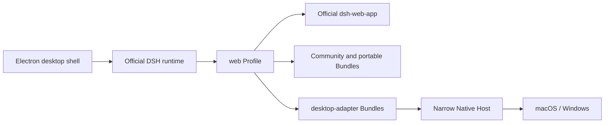

<h1 align="center">DSH Desktop</h1>

<p align="center">
  <strong>A plugin-first desktop workbench built around official DSH Web.</strong><br>
  Curated community Bundles, offline Profiles, Git Worktrees, file attachments, and controlled native capabilities in one Electron app.
</p>

<p align="center"><sub>An independent, community-maintained open-source project with no affiliation, partnership, authorization, or endorsement from DeepSeek.<br>English · <a href="README.md">中文</a> · <a href="README.anime.md">Anime README</a></sub></p>

<p align="center">
  <a href="https://github.com/vibeinging/dsh-desktop"></a>
  <a href="LICENSE"></a>
  
  
  
</p>

<p align="center">
  
</p>

DSH Desktop is a community-maintained Electron distribution. It pins and runs the official [DeepSeek Harness](https://github.com/deepseek-ai/deepseek-harness) npm runtime, composing `dsh-web-app`, Sessions, Agents, Tools, Skills, MCP, and Profile Bundles into a local desktop environment. It does not modify DSH source, maintain a second plugin state, or replace official Web with a private Chat implementation.

This repository owns the desktop distribution layer: it selects community Bundles suitable for the default experience, pins their source, version, dependencies, permissions, and licenses, then verifies installation, disabling, removal, restart, and recovery in real Profiles and Electron. The result is not a list of manual setup steps, but a composable, removable, and reproducible DSH workbench.

## The desktop route we commit to

| Principle | Product contract | Direct benefit |
| --- | --- | --- |
| Official Web is the only primary interface | The main window loads the official Client graph directly, and desktop UI joins as regular `dshClient` Bundles | DSH Sessions, settings, and Slots can evolve without waiting for a second interface to be rewritten |
| The Profile is the sole plugin authority | Market, settings, and CLI operate on the same Profile; updates never restore a Bundle the user removed | There is no split state where the desktop claims a plugin is installed while DSH never loaded it |
| Community implementations come first | The task board, plugin market, and attachment input are independent community Bundles | The same plugins can serve official Web and desktop distributions instead of being trapped in this repository |
| The default composition is reproducible | New Profiles initialize atomically and offline from pinned tarballs, SHA-256 values, and the packaged pnpm runtime | The default environment does not depend on assembling floating npm packages at first launch, and failed installation cannot publish half a Profile |
| Native access follows least privilege | Window, file, Browser Workspace, and update methods are exposed only through Session-bound allowlists | Third-party Clients cannot directly access Electron, Node, or general IPC |
| Failures remain diagnosable and recoverable | Profile or Client startup failures open local recovery while preserving the original Profile | Blank pages, restart loops, and silent configuration rewrites do not hide the failure |

This route is for users and plugin authors who want official DSH Web together with community plugins, controlled native capabilities, a predictable default composition, and explicit permission boundaries.

## Key capabilities

<table>
  <tr>
    <td width="50%" valign="top">
      <h3>Official DSH Web on desktop</h3>
      <p>Electron starts a local DSH Web Profile and manages the window, service startup, shutdown, and recovery. The main window loads the official Client graph directly, without the legacy Renderer or a product preload.</p>
    </td>
    <td width="50%" valign="top">
      <h3>Default plugin market</h3>
      <p><code>dshmarket@1.17.1</code> mounts in the official settings Slot and provides discovery, compatibility diagnostics, installation, updates, and removal. The market, settings page, and command line read and write the same Profile.</p>
    </td>
  </tr>
  <tr>
    <td width="50%" valign="top">
      <h3>Tasks, attachments, and community capabilities</h3>
      <p>The community task board provides a five-column workflow, the attachment Bundle adds file and folder selection to official input Slots, and dshmarket discovers additional standard Bundles.</p>
    </td>
    <td width="50%" valign="top">
      <h3>Workspace and output tools</h3>
      <p>Git Worktree, Project, Conversation, Canvas/Site, Structured UI, Office, and model inheritance live in separate Bundles. Users can remove what they do not need, while plugin authors can reuse the portable capabilities.</p>
    </td>
  </tr>
  <tr>
    <td width="50%" valign="top">
      <h3>Narrow native Host</h3>
      <p>Window, file authorization, Browser Workspace, and update capabilities are exposed only through method allowlists and Session binding. Third-party Clients cannot access Electron, Node, or general IPC.</p>
    </td>
    <td width="50%" valign="top">
      <h3>Offline initialization and recovery</h3>
      <p>A new Profile initializes atomically from pinned artifacts and the packaged pnpm runtime; existing Profiles remain unchanged during updates. Startup failures open recovery instead of a blank page or silently restoring plugins the user removed.</p>
    </td>
  </tr>
</table>

## How it runs



The official DSH runtime owns Agents, Sessions, Tools, Skills, MCP, Profiles, and Web UI. Community and portable Bundles use only public DSH services, so they can be installed in a compatible official Web Profile. Only `desktop-adapter` Bundles can call the desktop Host, and then only through declared, Session-bound methods.

This separation keeps official Web and DSH Desktop on one plugin system. UI, Tools, and workflows remain portable by default; only operating-system features such as file dialogs, window control, and the embedded browser require a desktop adapter.

## Current interface

### Official Sessions, questions, and approvals


Conversations, question cards, tool approvals, queued messages, and history replay remain in the official Session. The screenshot uses a real DeepSeek-V4-Flash conversation; the key is injected only into that temporary process and is written to neither the Profile nor the screenshot.

### Plugin market in official settings


Open **Settings → Plugin Market** to search, inspect compatibility and permissions, and install, update, or remove packages from the active Profile. The market is a regular Client Bundle and does not replace the official settings container.

### Git Worktree in an official Workspace


The Git Worktree Bundle identifies the main checkout from the current Session's `cwd`, manages isolated worktrees from the sidebar and Workspace, and creates official Sessions for new workspaces. It uses only DSH Workspaces and Slots, so it remains an independently installable and removable portable Bundle.

## Get and run

The current Preview channel is intended for developers running from source. The repository pins the official DSH npm runtime and default Bundles; it does not require a separate DSH source checkout or source modification.

### Run from source

Requires Node.js 24 or later:

```bash
git clone https://github.com/vibeinging/dsh-desktop.git
cd dsh-desktop
npm install
npm run doctor
npm run dev:electron
```

### macOS Apple Silicon development build

```bash
npm run package:mac:dir
open "release/mac-arm64/DSH Desktop.app"
```

This command creates an unsigned development build. Public macOS DMGs and Windows installers must come from the release workflow with complete signing, notarization, and receipt evidence; a local directory build never presents itself as a formal release.

## Plugin ecosystem

The DSH Profile is the sole authority for plugin state. A new Profile installs the default Bundles atomically through the official `dsh plugin --profile web` command. Existing Profiles remain read-only during app updates: the app does not restore, remove, or rewrite user choices. Bundles disabled or removed by the user stay disabled or removed after restarts and upgrades.

Most users can open **Settings → Plugin Market**. The command line uses the same Profile:

```bash
dsh plugin --profile web add -w <package>@<exact-version> --save-exact --ignore-scripts
dsh plugin --profile web remove <package>
```

New Profiles install the fixed `dshmarket@1.17.1` release by default. The distribution includes a reviewed fixed tarball, its complete runtime dependency closure, and SHA-256 values; default initialization needs no npm network access and runs no upstream lifecycle scripts. Browsing the market reaches the community catalog, while installation and updates may reach npm or GitHub. WebDAV and Gist are used only after explicit user configuration. A plugin appearing in the market is not necessarily bundled or approved for the distribution.

New Profiles also install `dsh-multimedia-webui-input@0.1.0`. It contributes a file/folder picker through the official `conversation.input.left`, `conversation.input.dock`, `conversation.input.overlay`, and `settings.section` Slots. Files are copied into the active Session workspace only when the message is sent. Official DSH remains responsible for image paste and drop; the bundled adaptation removes the upstream generic drop listeners so images cannot enter both paths. The plugin does not modify official Chat or receive Electron or general IPC access. Enabling another attachment-input plugin at the same time may create duplicate buttons or uploads, so the default Profile keeps a single attachment surface.

On the desktop side, `@vibeinging/dsh-desktop-profile-host` exposes only two public structural services: `desktopProfiles` and `desktopPnpm`. The market delegates user-confirmed operations to the packaged pnpm runtime and the official DSH CLI; it cannot acquire Electron permissions or restart the app itself.

### Plugin trust levels

| Level | User experience | Distribution responsibility |
| --- | --- | --- |
| Discoverable in the market | The user inspects and explicitly installs a listing | Market visibility is not review, bundling, or endorsement by this distribution |
| Recorded candidate | The catalog shows compatibility, permissions, conflicts, and known blockers | Pin upstream source and record the review result, but keep it out of the default Profile |
| Packaged but optional | Install from a pinned local artifact without network access | Preserve licenses, hashes, dependencies, and install/removal evidence |
| Packaged and default | Install atomically into new Profiles while remaining removable | Verify against current DSH, source Profiles, packaged Electron, offline startup, and removal recovery |

These levels separate “exists in the community,” “can be installed by the user,” and “is suitable as a distribution default.” New defaults are never silently added to an existing Profile during an app update; existing users retain their own composition.

<details>
<summary>View the 13 Bundles installed in a new Profile</summary>

<!-- featured-plugins:start -->
| Default Bundle | Type | Declared permissions | Official management | Source |
|---|---|---|---|---|
| `@vibeinging/dsh-work-product-host-ipc` | desktop-adapter | dsh-work-parent-ipc, browser-workspace-host, file-dialog-host, window-host | desktop foundation; uninstall is not offered | [local package](packages/dsh-work-product-host-ipc) |
| `@vibeinging/dsh-desktop-profile-host` | desktop-adapter | dsh-profile-filesystem, controlled-pnpm-runtime, dsh-cli-runtime | desktop foundation; uninstall is not offered | [local package](packages/dsh-desktop-profile-host) |
| `@vibeinging/dsh-desktop-chrome` | desktop-adapter | no Host permission | `dsh plugin --profile web remove @vibeinging/dsh-desktop-chrome` | [local package](packages/dsh-desktop-chrome) |
| `@vibeinging/dsh-project-tools` | desktop-adapter | product-host | `dsh plugin --profile web remove @vibeinging/dsh-project-tools` | [local package](packages/dsh-project-tools) |
| `@vibeinging/dsh-canvas-tools` | desktop-adapter | product-host | `dsh plugin --profile web remove @vibeinging/dsh-canvas-tools` | [local package](packages/dsh-canvas-tools) |
| `@vibeinging/dsh-structured-ui-tools` | desktop-adapter | product-host | `dsh plugin --profile web remove @vibeinging/dsh-structured-ui-tools` | [local package](packages/dsh-structured-ui-tools) |
| `@vibeinging/dsh-model-inheritance` | portable | no Host permission | `dsh plugin --profile web remove @vibeinging/dsh-model-inheritance` | [local package](packages/dsh-model-inheritance) |
| `@vibeinging/dsh-product-bridge` | desktop-adapter | product-host | `dsh plugin --profile web remove @vibeinging/dsh-product-bridge` | [local package](packages/dsh-product-bridge) |
| `@vibeinging/dsh-office-tools` | desktop-adapter | office-artifact-host | `dsh plugin --profile web remove @vibeinging/dsh-office-tools` | [local package](packages/dsh-office-tools) |
| `@vibeinging/dsh-client-ui-worktree` | portable | no Host permission | `dsh plugin --profile web remove @vibeinging/dsh-client-ui-worktree` | [local package](packages/dsh-worktree) |
| `@linxin666/dsh-client-ui-task-board` | portable | read current DSH Session, Workspace, and completion history, write task ledger and run records under DSH_HOME, start DSH Session tasks from user actions or Host cron, optionally start a fixed cross-platform sleep-prevention helper | `dsh plugin --profile web remove @linxin666/dsh-client-ui-task-board` | [upstream repository](https://github.com/zhu1090093659/dsh-web-ui) |
| `dsh-multimedia-webui-input` | portable | read files and folders explicitly selected by the user, write attachments under .dsh/tmp/attachments in the active Session workspace, remove only plugin-owned attachment directories after a second user confirmation | `dsh plugin --profile web remove dsh-multimedia-webui-input` | [upstream repository](https://github.com/LCYLYM/dsh-attachments) |
| `dshmarket` | portable | read and modify dependencies, Bundle order, and enabled state in the active DSH Profile, install, update, and remove user-confirmed plugins through controlled pnpm, access the plugin catalog, npm, GitHub, and user-configured WebDAV or Gist services, export or import backups that contain Profile configuration | `dsh plugin --profile web remove dshmarket` | [upstream repository](https://github.com/dsh-market/dsh-market) |
<!-- featured-plugins:end -->

</details>

## Developing plugins

App capabilities are split into two boundary types:

- A `portable` Bundle uses only official DSH services and can be installed in a compatible official Web Profile.
- A `desktop-adapter` Bundle uses the narrow Host contract provided by DSH Desktop and should report the missing capability directly when used outside the desktop host.

First-party Bundles live in [`packages/`](packages/). Prefer existing community plugins for new capabilities; add an independent Bundle only when the community has no reviewable implementation. Plugins must not modify official DSH source code directly or bypass the Profile by storing a second installation state.

For the plugin market integration, permissions, and offline boundary, see [Plugin market selection and desktop integration](docs/research/2026-08-22_dsh-plugin-market-selection.md). For the complete architecture and release sequence, see the [distribution migration plan](docs/plans/2026-08-20_dsh-app-发行版转型最终方案.md).

## Data and security

- Profiles, Sessions, and local runtime data are stored under `~/.dsh` by default; opening history does not upload that data automatically.
- Official Web `webContents` has no product preload, Node access, or general IPC.
- If Profile or Client startup fails, the app opens a local recovery page instead of showing a blank window or silently changing the original Profile.
- The recovery page can retry, start a safe Profile containing only the official `base` and `web-app`, open directories, remove a specified plugin after confirmation, and export filtered diagnostics.
- Project code, third-party Bundles, and visual assets each follow their own licenses and redistribution terms.

See the [privacy notice](PRIVACY.md), [security policy](SECURITY.md), and [third-party notices](THIRD_PARTY_NOTICES.md).

## Development and verification

The repository does not treat “can be built” as “can be released.” Verification is divided into independent levels:

| Evidence level | Question it must answer |
| --- | --- |
| Source contracts | Is official Web still the only entry point, and have plugin, native Host, or artifact boundaries drifted? |
| Profile integration | Can every default Bundle be installed and removed through the official CLI, and does disabling really keep it out of the active graph? |
| Packaged Electron | Does the Client actually join the official boot graph and render an interactive UI, and does official Web return to baseline after removal and restart? |
| Offline and budgets | Can a new user initialize from packaged artifacts, and are App, Server, pnpm, tarballs, Profile storage, and cold start within their limits? |
| Signed release | Are the App, DMG, or EXE bound to the commit, hashes, signer, platform, architecture, notarization, and interaction receipts? |

All 13 default Bundles pass per-package source Profile measurement. The task board, dshmarket, Git Worktree, and file/folder attachment Bundles also pass installation, Client activation, disabling, official removal, and post-removal restart in packaged macOS arm64 Electron. In the current offline candidate, curated tarballs total 1,639,477 bytes, first Profile storage is 17,337,154 bytes, and official Web cold start is 12,304 ms; all remain within hard limits.

Common commands:

```bash
npm run test:release
npm run typecheck
npm run check:release-boundary
npm run check:release-artifacts
npm run check:release:budgets
npm run measure:featured-plugins
```

See the [attachment Bundle integration report](docs/reports/2026-08-23_dsh-attachment-plugin-integration.md) for the latest community-plugin evidence and the [release evidence report](docs/reports/2026-08-20_dsh-app-release-evidence.md) for the complete release boundary. A real DeepSeek-V4-Flash development interaction passes official Web, Session history, provider-origin, and complete-response validation; a formal Release still requires that result to be bound to the final signed artifact.

## Other community desktop distributions

[anywhere-labs/deepseek-harness-desktop](https://github.com/anywhere-labs/deepseek-harness-desktop) and this project are both independent community distributions, but they choose different desktop routes. The anywhere-labs project combines a complete desktop Shell, tray, terminal, updates, and cross-platform installers. This project pins the official npm runtime, keeps official Web as the only primary interface, and focuses on independent community Bundles, reproducible offline Profile artifacts, and a narrow Native Host.

Neither project is the official DeepSeek Harness desktop client. This repository makes no “more official” claim; its stable boundaries are one official Web interface, one Profile authority, community plugins first, reproducible defaults, and least-privilege native access. See the [source-backed comparison](docs/research/2026-08-22_dsh-desktop-distribution-differences.md) for implementation-level differences.

## Related projects

| Project | Relationship |
| --- | --- |
| [DeepSeek Harness](https://github.com/deepseek-ai/deepseek-harness) | Provides the core Agent, Session, Tool, Skill, MCP, Profile, and official Web |
| [Cordis](https://github.com/cordiverse/cordis) | Provides the plugin foundation |
| [dsh-market](https://github.com/dsh-market/dsh-market) | The visual plugin market bundled by default |
| [dsh-web-ui](https://github.com/zhu1090093659/dsh-web-ui) | Upstream community repository for the current task board |
| [DSH Desktop by anywhere-labs](https://github.com/anywhere-labs/deepseek-harness-desktop) | An independent community distribution centered on a complete desktop Shell and cross-platform installers |
| [dshfind](https://www.dshfind.com/en) | A community for learning, sharing, and discovering DSH plugins |

## Relationship to DeepSeek Harness

DSH Desktop is an independent community project built on DeepSeek Harness and the Cordis plugin model. Upstream provides the core runtime, plugin system, and Web UI; this project provides the Electron wrapper, offline initialization for new Profiles, curated community Bundles, narrow native Host, recovery page, and desktop release verification.

This project has no affiliation, partnership, authorization, or endorsement from DeepSeek. “DeepSeek Harness” is used only to describe compatibility and technical origins accurately.

## License

Project code is available under the [MIT License](LICENSE). Sources and distribution terms for third-party components, fixed tarballs, native binaries, and visual assets are listed in [THIRD_PARTY_NOTICES.md](THIRD_PARTY_NOTICES.md).
