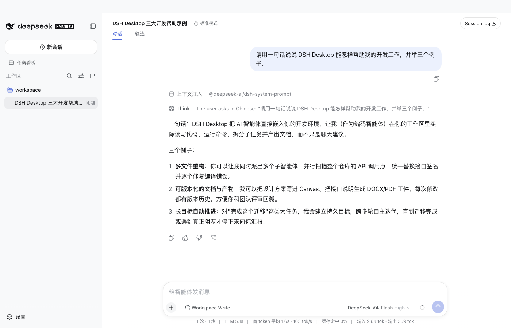
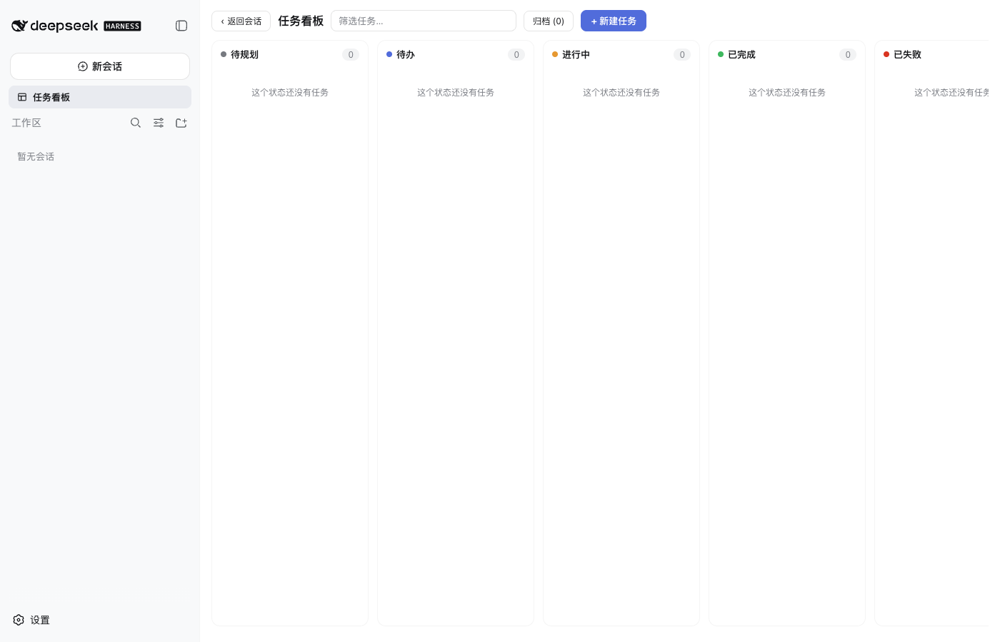

# DSH Desktop

[English](README.en.md)

DSH Desktop 是社区维护的 Electron 桌面发行版。它把官方 DeepSeek Harness（DSH）Web、Profile、Session、Agent、Tool、Skill 和 MCP 运行时放进本地应用；主窗口只显示官方 `dsh-web-app`，不再维护第二套 Chat、首页、设置或插件中心。

Profile、Session 和本地运行数据默认保存在 `~/.dsh`，应用不会因为打开历史记录而自动上传这些内容。

## 使用和开发

已发布安装包不要求用户安装系统 Node.js、pnpm、npm 登录或首启联网。它携带 DSH Web 运行时、精选 Bundle 的固定 tarball 和受控 pnpm。

开发环境要求 Node.js 24 或更高版本：

```bash
npm install
npm run doctor
npm run dev:electron
```

默认桌面开发安装只准备 Server 和 Electron；旧 Renderer 不属于官方 Web 发行路径。需要维护 legacy Renderer 时，单独在 `renderer/` 执行 `npm ci`，再使用 `npm run dev:legacy-renderer` 或 `npm run test:legacy-renderer`。

打包和发行边界检查：

```bash
npm run check:release-boundary
npm run release:check:static
npm run package:mac:dir
npm run check:release-artifacts
npm run check:release:budgets
npm run measure:featured-plugins
npm run smoke:official-web
npm run smoke:featured-plugins:packaged
npm run smoke:community:packaged
npm run smoke:official-web:flow
npm run smoke:official-web:interactions
npm run smoke:updater
npm run smoke:browser-workspace
DSH_BROWSER_SCREENSHOT_DIR=/path/to/evidence npm run smoke:browser-workspace
npm run test:release
npm run test:release:community
# 真实社区回归也可保存 task-board Electron 截图
DSH_COMMUNITY_SCREENSHOT_DIR=/path/to/evidence npm run test:release:community
```

## Profile 和插件状态

DSH Profile 是插件状态的唯一权威。已有 Profile 的启动、状态查询和应用更新只读 `dsh.profile.bundles`、依赖和 patch；它们不会补回、隔离、删除或重写用户选择。用户停用或卸载 Bundle 后，重启、应用更新和精选清单变化都不会自动恢复它。

新 Profile 才会在隔离目录中通过官方 `dsh plugin --profile web` 命令原子安装默认 Bundle。安装、更新和卸载由官方 DSH Profile 命令执行，并使用安装包内的固定 tarball、固定 SHA-256 和受控 pnpm。

默认精选输入只有一份：[featured_plugins.json](server/src/engine/dsh_runtime/featured_plugins.json)。它生成随包 tarball、Profile 初始化输入、权限摘要、第三方公告和测试预期；其他代码和文档不维护第二份默认包名列表。

当前默认精选如下；它们都是非 UI Bundle，Host、portable 或 desktop-adapter 能力均通过官方 Profile 接入，不替换官方 Web 页面。每个条目的来源、权限和官方管理方式由 [精选清单](server/src/engine/dsh_runtime/featured_plugins.json) 生成；应用更新不会重新安装用户已卸载的条目。自研包使用 `@vibeinging/*` scope；官方 DSH SDK 仍使用 `@deepseek-ai/*` scope。

<!-- featured-plugins:start -->
| 默认 Bundle | 类型 | 声明权限 | 官方管理方式 | 来源 |
|---|---|---|---|---|
| `@vibeinging/dsh-work-product-host-ipc` | desktop-adapter | dsh-work-parent-ipc、browser-workspace-host、file-dialog-host、window-host | 桌面基础服务，不提供卸载 | [本地包](packages/dsh-work-product-host-ipc) |
| `@vibeinging/dsh-project-tools` | desktop-adapter | product-host | `dsh plugin --profile web remove @vibeinging/dsh-project-tools` | [本地包](packages/dsh-project-tools) |
| `@vibeinging/dsh-canvas-tools` | desktop-adapter | product-host | `dsh plugin --profile web remove @vibeinging/dsh-canvas-tools` | [本地包](packages/dsh-canvas-tools) |
| `@vibeinging/dsh-structured-ui-tools` | desktop-adapter | product-host | `dsh plugin --profile web remove @vibeinging/dsh-structured-ui-tools` | [本地包](packages/dsh-structured-ui-tools) |
| `@vibeinging/dsh-model-inheritance` | portable | 无 Host 权限 | `dsh plugin --profile web remove @vibeinging/dsh-model-inheritance` | [本地包](packages/dsh-model-inheritance) |
| `@vibeinging/dsh-product-bridge` | desktop-adapter | product-host | `dsh plugin --profile web remove @vibeinging/dsh-product-bridge` | [本地包](packages/dsh-product-bridge) |
| `@vibeinging/dsh-office-tools` | desktop-adapter | office-artifact-host | `dsh plugin --profile web remove @vibeinging/dsh-office-tools` | [本地包](packages/dsh-office-tools) |
<!-- featured-plugins:end -->

## 可选插件

应用不建设第二套安装状态。发现、安装、停用、更新和卸载都回到官方 Profile 命令或官方 Web 插件管理能力。

我方 portable 候选：

该包当前作为源码候选维护；发布到 npm 前可用本地路径通过同一套官方 Profile 命令预检：

```bash
dsh plugin --profile web add -w /path/to/dsh-work-references --save-exact --ignore-scripts
dsh plugin --profile web remove @vibeinging/dsh-work-references
```

它只在当前 DSH Session 的工作目录内提供有上限的相对文件引用，不接受浏览器传入的绝对路径。

社区独立 UI 候选 `@linxin666/dsh-client-ui-task-board@0.1.20`（上游 [dsh-web-ui](https://github.com/zhu1090093659/dsh-web-ui)）已完成固定版本的网络安装、官方 Web 激活、真实 Electron 启动、任务看板入口与五列看板配置检查、官方卸载命令和重启回归；它是可选候选，不进入默认精选。它声明的权限是读取当前 DSH Session 与 Workspace、写入任务看板数据、按用户操作启动 DSH Session 任务。`DSH_COMMUNITY_SCREENSHOT_DIR=/path npm run test:release:community` 可保存开发态真实 Electron 看板截图；`DSH_COMMUNITY_SCREENSHOT_DIR=/path npm run smoke:community:packaged` 可保存打包版安装前、候选激活态和官方卸载后的基线三帧：

```bash
dsh plugin --profile web add -w @linxin666/dsh-client-ui-task-board@0.1.20 --save-exact --ignore-scripts
dsh plugin --profile web remove @linxin666/dsh-client-ui-task-board
```

要把安装包来源也纳入社区回归，可在 macOS 上只读挂载 DMG、复制其中的 App，再运行同一套官方安装/激活/卸载/重启检查：

```bash
DSH_COMMUNITY_SCREENSHOT_DIR=/path/to/evidence DSH_MACOS_INSTALLER_RESULT_FILE=/path/to/evidence/macos-installer.json npm run smoke:macos:installer -- /path/to/dsh-desktop-0.0.1-mac-arm64.dmg
```

`@linxin666/dsh-web-ui-all` 是聚合包，只用于冲突实验，不是发行输入。Better Sidebar、远程 Web、SSH、图像理解、Agent 预设和社区插件管理器没有进入默认 Profile。没有固定来源、完整依赖审查、真实 Electron 回归和卸载证据的社区包不会写入精选清单。

皮肤中心和它依赖的 `@linxin666/dsh-skins` 当前不随包分发。上游包级 Apache-2.0 许可证不自动覆盖所有内建视觉资产；上游说明 Maid Atelier 资产使用 CC BY-NC-SA 4.0，不能在没有单独再分发授权的情况下进入发行包。许可结论记录在 [社区插件目录](server/src/engine/dsh_runtime/community_plugin_registry.json) 中，发行边界会阻止未批准的视觉资产进入精选清单。只有逐项资产许可证、署名和再分发条件都通过后，皮肤中心才可重新评估。

## 当前验证截图



上图来自当前打包 Electron 的 loopback SSE 交互 smoke，证明官方 Web 的 Session、轨迹和工具结果投影；它不是真实 DeepSeek live-model 证据。



上图来自当前 arm64 打包版的固定版本社区 Bundle 回归，证明 task-board 在官方 Web 根节点内激活并显示五列；它是可选候选，不是默认精选。

## Electron 原生边界

官方 Web 所在的 `webContents` 没有产品 preload、Node 或通用 IPC。Electron 主进程只保留受限的原生 Host：窗口、更新、文件授权和 Browser Workspace。Browser Workspace 的导航、标签、下载、历史、查找、缩放、页面抓取和权限请求都通过方法白名单、Session 绑定和边界校验完成；第三方 Client 不能取得 Electron 对象或 Node 文件系统。

官方 Web Session 对窗口原生 Host 的授权只允许白名单方法，不携带 dsh-work 用户或项目身份；`smoke:native-host` 已在当前 macOS arm64 打包 Electron 中真实验证状态、聚焦、最小化、最大化和恢复，并在结束时通过官方 Profile 命令卸载测试 Bundle。文件/目录对话框和跨平台窗口交互仍需对应发行环境验收。

## 启动失败恢复

DSH 子进程、Profile 解析或 Client 启动失败时，应用进入本地恢复页，而不是白屏或静默修改原 Profile。恢复页支持：

- 重试原 Profile；
- 在不改原 Profile 的情况下启动只含官方 `base` 和 `web-app` 的安全 Profile；
- 打开 Profile 目录；
- 用户明确确认后移除指定插件；
- 导出过滤后的诊断信息。

诊断会限制长度并移除环境变量、凭据、Session 内容、用户文件内容和完整堆栈。最近失败阶段和处理结果写入受限的本地恢复状态，避免无限重启。

## 验证边界

源码检查和单元测试不能替代真实发行证据。当前仓库分别使用以下证据层级：

- 源码和 Profile 集成：官方 Web 组合、只读已有 Profile、固定 tarball、离线初始化和权限投影测试；
- 真实 Electron：官方 Web 无 preload 启动、工作区、Session、Session log、history 用户流程、社区 task board 入口/五列看板/官方 Web 容器内激活和 Browser Workspace WebContentsView 烟测。`smoke:official-web:flow` 会在无 API key 的临时用户目录运行，并可用 `DSH_SCREENSHOT_DIR=/path npm run smoke:official-web:flow` 保存官方 Web 截图；`DSH_COMMUNITY_SCREENSHOT_DIR=/path npm run test:release:community` 可保存开发态 task board 看板截图，`DSH_COMMUNITY_SCREENSHOT_DIR=/path npm run smoke:community:packaged` 可保存打包版安装前、激活态和卸载后基线三帧；`DSH_BROWSER_SCREENSHOT_DIR=/path npm run smoke:browser-workspace` 可保存真实 WebContentsView 页面截图；`npm run smoke:native-host` 在打包 Electron 中通过官方 Web Tool 真实验证 session-bound 窗口 Host 的状态、聚焦、最小化、最大化和恢复；`smoke:official-web:interactions` 在同一打包 Electron 中用 loopback SSE 测试模型驱动官方 LLM、问题卡片、bash 沙箱拒绝/升权、审批面板、QueueDock 和 Session history，并用 `DSH_SCREENSHOT_DIR=/path npm run smoke:official-web:interactions` 保存问题/审批/队列截图；它验证的是官方运行时和 UI 契约，不替代真实 DeepSeek 服务的 live-model 证据；有凭据的发行环境使用 `DEEPSEEK_API_KEY=... npm run smoke:official-web:live` 运行真实模型基础流程，无 key 时该命令会 fail closed；`smoke:updater` 还会用本地 HTTPS feed 验证更新元数据、固定哈希下载、Profile 预检、临时 App 替换和历史回放，但完整替换需要 Developer ID 签名包；
- 安装包：`package:mac:dir` 生成随包目录，`smoke:official-web` 验证随包官方 Web，`smoke:community:packaged` 验证打包版 App 先初始化精选 Profile，再通过官方命令安装、激活、卸载和重启独立社区 Bundle；`smoke:native-host` 覆盖打包版官方 Web 到 Electron 窗口 Host 的真实调用链；`smoke:macos:installer -- /path/to/*.dmg` 会只读挂载 DMG、复制 App，并重复这条 Profile 生命周期，设置 `DSH_COMMUNITY_SCREENSHOT_DIR=/path` 可保存安装前、激活态和卸载后的三帧。Browser Workspace 截图先使用 Electron `capturePage`，在当前 Viz 不可用时回退到受控的 DevTools Page 截图协议；文件/目录对话框、Windows 实机、原生 x64 和真实 DeepSeek live-model 仍需在对应发行环境完成。

详见 [发行方案](docs/plans/2026-08-20_dsh-app-发行版转型最终方案.md)、[隐私说明](PRIVACY.md)、[安全说明](SECURITY.md) 和 [第三方说明](THIRD_PARTY_NOTICES.md)。
