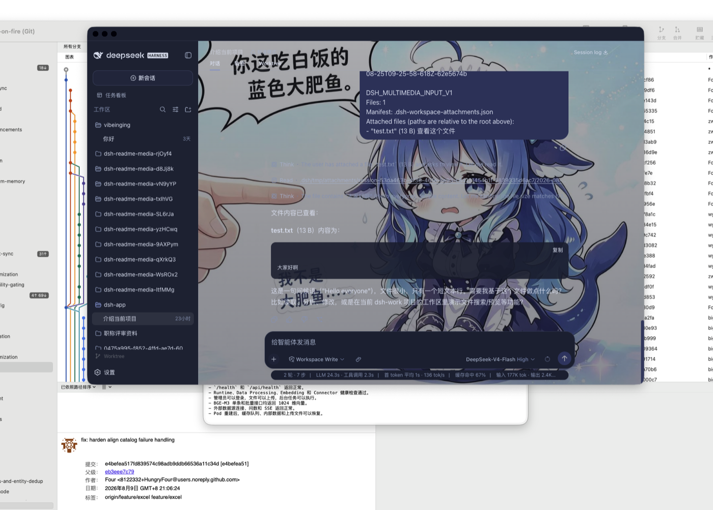

<h1 align="center">DSH Desktop</h1>

<p align="center">
  <strong>DSH Desktop 插件集成版（DSH Desktop Bundle Edition）—— 把官方 DSH Web、社区插件和桌面能力装进一个开箱即用的应用。</strong><br>
  对话、文件、Git、终端、任务、Worktree 与插件市场，都运行在同一个 DSH Profile 中。
</p>

<p align="center"><a href="README.en.md">English</a></p>

<p align="center">
  <a href="https://dshdesktopstation.com/"></a>
  <a href="https://github.com/vibeinging/dsh-desktop/releases/latest"></a>
  <a href="https://github.com/vibeinging/dsh-desktop"></a>
  <a href="https://dshfind.com/zh/plugins/vibeinging/dsh-desktop?ref=badge"></a>
  <a href="LICENSE"></a>
  
  
</p>

<p align="center">
  
</p>

DSH Desktop（插件集成版 / Bundle Edition）是一个社区维护的桌面发行版。它直接运行官方 [DeepSeek Harness](https://github.com/deepseek-ai/deepseek-harness) npm 运行时与官方 `dsh-web-app`，并预装一组经过固定和验证的社区 Bundle。你不需要先搭环境、找插件或维护另一套插件状态，打开应用即可从同一个 Profile 开始工作。

[官网](https://dshdesktopstation.com/) · [下载最新版](https://github.com/vibeinging/dsh-desktop/releases/latest) · [手机远程](https://dshdesktopstation.com/remote/) · [开始使用](#开始使用) · [安装插件](#安装更多插件)

## 下载

| 平台 | 安装方式 | 状态 |
| --- | --- | --- |
| macOS Apple Silicon | 下载 `.dmg`，拖入“应用程序” | Developer ID 签名并完成 Apple 公证 |
| Windows x64 | 下载 `.exe`，选择安装范围与客户端目录 | 以当前 [Release](https://github.com/vibeinging/dsh-desktop/releases/latest) 页面提供的产物为准 |
| macOS Intel / Linux | 暂无正式安装包 | 可以从源码运行 |

各平台直链与文件大小见[官网下载页](https://dshdesktopstation.com/#download)；首跑常见问题（Gatekeeper、SmartScreen、API Key、国内下载）见[官网 FAQ](https://dshdesktopstation.com/#faq)。

客户端安装目录只保存应用程序。Profile、插件、Session 和其他 DSH 数据由独立的数据目录管理；更换客户端安装位置不会迁移或删除这些数据。

## 打开就能用

<table>
  <tr>
    <td width="50%" valign="top">
      <h3>官方对话与 Agent</h3>
      <p>主窗口就是官方 DSH Web。Session、Agent、Tool、Skill、MCP、设置和历史由 DSH 自己管理，没有第二套 Chat 页面。</p>
    </td>
    <td width="50%" valign="top">
      <h3>Better Sidebar 工作台</h3>
      <p>内置文件树、代码与 Markdown 编辑、Git、终端、网页与扩展 Tab。0.18.0-alpha.0 对接当前 alpha SDK，并保留多仓库、Worktree、Vue 文件和本地 Markdown 图片等能力。</p>
    </td>
  </tr>
  <tr>
    <td width="50%" valign="top">
      <h3>插件市场</h3>
      <p>在官方设置页里发现、安装、更新、停用和卸载插件。界面、CLI 和应用重启都以同一个 Profile 为准。</p>
    </td>
    <td width="50%" valign="top">
      <h3>任务、附件与 Worktree</h3>
      <p>任务看板、文件和文件夹附件、Git Worktree、项目工具、Office 与结构化结果都由独立 Bundle 提供，可以按需组合。</p>
    </td>
  </tr>
  <tr>
    <td width="50%" valign="top">
      <h3>桌面 Host 与恢复</h3>
      <p>应用负责窗口、原生文件选择、更新、启动和恢复。正式安装包通过右上角按钮提示更新，悬停可看更新日志，点击后才下载、预检 Profile 并安装；Profile 或 Client 出错时进入恢复页。</p>
    </td>
    <td width="50%" valign="top">
      <h3>可复现的默认环境</h3>
      <p>新 Profile 从随包固定产物离线初始化；普通启动不重写已有 Profile，也不会把用户卸载的插件悄悄装回来。</p>
    </td>
  </tr>
  <tr>
    <td width="50%" valign="top">
      <h3>手机远程</h3>
      <p>登录并启用当前电脑后，可以从 Android、Remote Web 或另一台 Desktop 继续同一 Workspace 和 Session。Host 只建立出站连接，不开放公网监听端口。</p>
    </td>
    <td width="50%" valign="top">
      <h3>明确的服务边界</h3>
      <p>当前账号、设备目录、信令和中继由第三方服务提供；连接方式、安全边界和停用方法见<a href="https://dshdesktopstation.com/remote/">手机远程说明</a>。</p>
    </td>
  </tr>
</table>

## 界面

### 对话、问题卡片与审批


对话、工具审批、问题卡片、排队消息和历史回放都留在官方 Session 中。

### 官方设置里的插件市场


插件市场使用官方设置 Slot，不替换设置页面，也不另建插件数据库。

### Git Worktree 工作区


从当前 Session 的工作目录创建隔离 Worktree，并为新工作区建立官方 Session。

## 默认内置：手机远程

新 Profile 默认包含精确固定的 [`ds-harness-remote@0.4.1`](https://github.com/liguobao/ds-harness-remote/tree/v0.4.1)，与 DSH `0.1.5-rc.1` 试用线一起随包提供。打开侧栏 Remote，登录并为当前电脑启用远程访问后，就可以从 [Remote Web](https://dsh.r2049.cn/app)、Android App 或另一台 Desktop 打开同一 Host 的 Workspace 和 Session，继续对话、发送图片和处理权限请求。

- **网络边界**：Host 只建立出站连接，不开放公网监听端口；Remote 依次尝试 LAN、P2P、TURN 与 Relay，所有路径都承载 Noise IK 加密后的业务流量。
- **账号与数据**：当前默认连接 `dsh.r2049.cn` 的第三方账号、设备目录、信令和中继服务；设备身份与凭据保存在 `DSH_HOME`。未登录并启用当前电脑时不会提供远程访问。
- **已授权设备**：通过固定 Harness API 白名单控制当前 Harness，Agent 仍可按原权限运行工具；不开放直接 Shell、PTY 或通用文件 RPC。
- **卸载**：升级后的现有 Profile 会补充一次这个默认 Bundle；如果你停用或卸载，应用更新不会再次恢复。

```bash
dsh plugin --profile web remove ds-harness-remote
```

> 该项目尚未提供受支持的自建 Server，独立密码安全审查、真实双机跨网和长期稳定性验证仍未完成；不需要远程能力时可以直接卸载。桌面发行包对该固定 tarball 应用带 SHA-256 校验的兼容投影，不修改官方 DSH 或上游仓库源码。连接方式、安全边界与停用方法也见[手机远程说明](https://dshdesktopstation.com/remote/)。

特别感谢 [DeepSeek Harness Remote Web](https://dsh.r2049.cn/app) 为社区提供当前可用的远程入口与配套服务，让 DSH Desktop 用户可以从手机或浏览器继续工作。

## 默认内置：会话窗口团队

新 Profile 默认包含 [`@vibeinging/dsh-session-teams@0.1.1`](https://github.com/vibeinging/dsh-session-teams)。它让 DSH 会话窗口之间可以直接协作：

- **给另一个窗口发消息**：告诉当前窗口"把这件事交给 `窗口名`"，消息会以真实 DSH 消息的形式出现在目标窗口——目标可见、可持久、可点击回溯到源。
- **让一个窗口当队长**：创建一组带角色的窗口，给它们分配任务与依赖，成员完成后以真实消息回报结果，队长用自然语言调整任务而不用记 ID。

所有团队与窗口状态通过官方 Session API 读写当前 Profile，不建立外部网络连接。不需要时可以卸载：

```bash
dsh plugin --profile web remove @vibeinging/dsh-session-teams
```

## 为什么选择这条路线

| 你关心的事 | DSH Desktop 的做法 |
| --- | --- |
| 是否依赖私有前端 | 直接加载官方 Web 与 npm 运行时，不维护私有 Chat 分叉 |
| 社区插件能否直接使用 | 普通 UI、Tool 和工作流继续使用官方 Bundle、Service 与 Slot |
| 插件状态会不会错乱 | 官方 Profile 是唯一权威；市场、设置和 CLI 操作同一份数据 |
| 默认插件是否可靠 | 固定版本、完整性、权限、依赖和许可证，并保留离线安装产物 |
| 原生能力是否过大 | 文件、窗口和 Browser Workspace 只通过按 Session 绑定的有限方法开放 |
| 启动会不会覆盖配置 | 已有 Profile 保持用户选择；失败时保留原 Profile 并进入恢复页 |
| 应用更新会不会改插件 | 更新前只读预检 Profile；不恢复用户已停用或卸载的 Bundle |

Electron 在这里是一层很薄的桌面 Host。真正的 Agent、会话和插件系统仍属于 DSH；项目自己的功能也尽量拆成 Bundle。这样，portable 插件可以同时安装到兼容的官方 Web 和 DSH Desktop，桌面专属能力才使用明确的 `desktop-adapter`。

## 开始使用

1. 从 [Releases](https://github.com/vibeinging/dsh-desktop/releases/latest) 下载适合的平台安装包。
2. 启动应用，选择一个工作目录或直接创建会话。
3. 在侧栏打开文件、Git 或终端；在输入框添加文件和文件夹。
4. 需要更多能力时，打开“设置 → 插件市场”。

模型凭据由 DSH 设置与本地环境管理。项目不会把 API Key 写入 README、截图或插件清单。

## 安装更多插件

普通用户直接使用“设置 → 插件市场”。插件市场会显示来源、版本、兼容性和权限；安装前仍应查看上游说明，市场可见不等于本项目已经审查或默认内置。

也可以使用官方 CLI 操作同一个 Profile：

```bash
dsh plugin --profile web add -w <package>@<exact-version> --save-exact --ignore-scripts
dsh plugin --profile web remove <package>
```

符合官方 DSH Bundle 与 `dshClient` 合同的插件，不需要专门为 DSH Desktop 重写。需要窗口、原生文件对话框或 Browser Workspace 的插件，则要显式使用 DSH Desktop 的窄 Host 合同；在其他宿主中缺少这些能力时应直接报告。

### 可选示例：皮肤中心



应用默认保持官方 Web 外观。想要个性化界面时，可从插件市场安装社区维护的[皮肤中心](https://github.com/zhu1090093659/dsh-web)（`@linxin666/dsh-client-ui-skin-center`）：数十款皮肤试穿即生效、不落盘可还原，官方外观随时切回。

```bash
dsh plugin --profile web add @linxin666/dsh-client-ui-skin-center
```

皮肤资产各自带有上游许可（部分为 CC BY-NC-SA 或含角色版权），因此皮肤中心不随应用默认内置，由用户在市场自行选择安装。

### 默认插件

新 Profile 默认包含 Better Sidebar、dshmarket、任务看板、附件输入、Git Worktree、手机远程、会话窗口团队，以及项目、Canvas、Office、结构化结果和模型继承等能力。所有可管理 Bundle 都能被停用或卸载。

<details>
<summary>查看新 Profile 默认安装的 16 个 Bundle</summary>

<!-- featured-plugins:start -->
| 默认 Bundle | 类型 | 声明权限 | 官方管理方式 | 来源 |
|---|---|---|---|---|
| `@vibeinging/dsh-work-product-host-ipc` | desktop-adapter | dsh-work-parent-ipc、browser-workspace-host、file-dialog-host、window-host | 桌面基础服务，不提供卸载 | [本地包](packages/dsh-work-product-host-ipc) |
| `@vibeinging/dsh-desktop-profile-host` | desktop-adapter | dsh-profile-filesystem、controlled-pnpm-runtime、dsh-cli-runtime | 桌面基础服务，不提供卸载 | [本地包](packages/dsh-desktop-profile-host) |
| `@vibeinging/dsh-desktop-chrome` | desktop-adapter | 无 Host 权限 | `dsh plugin --profile web remove @vibeinging/dsh-desktop-chrome` | [本地包](packages/dsh-desktop-chrome) |
| `@vibeinging/dsh-project-tools` | desktop-adapter | product-host | `dsh plugin --profile web remove @vibeinging/dsh-project-tools` | [本地包](packages/dsh-project-tools) |
| `@vibeinging/dsh-canvas-tools` | desktop-adapter | product-host | `dsh plugin --profile web remove @vibeinging/dsh-canvas-tools` | [本地包](packages/dsh-canvas-tools) |
| `@vibeinging/dsh-structured-ui-tools` | desktop-adapter | product-host | `dsh plugin --profile web remove @vibeinging/dsh-structured-ui-tools` | [本地包](packages/dsh-structured-ui-tools) |
| `@vibeinging/dsh-model-inheritance` | portable | 无 Host 权限 | `dsh plugin --profile web remove @vibeinging/dsh-model-inheritance` | [本地包](packages/dsh-model-inheritance) |
| `@vibeinging/dsh-product-bridge` | desktop-adapter | product-host | `dsh plugin --profile web remove @vibeinging/dsh-product-bridge` | [本地包](packages/dsh-product-bridge) |
| `@vibeinging/dsh-office-tools` | desktop-adapter | office-artifact-host | `dsh plugin --profile web remove @vibeinging/dsh-office-tools` | [本地包](packages/dsh-office-tools) |
| `@vibeinging/dsh-client-ui-worktree` | portable | 无 Host 权限 | `dsh plugin --profile web remove @vibeinging/dsh-client-ui-worktree` | [本地包](packages/dsh-worktree) |
| `@linxin666/dsh-client-ui-task-board` | portable | 读取当前 DSH Session、Workspace 与完成历史、在 DSH_HOME 写入任务账本和执行记录、按用户操作或 Host cron 启动 DSH Session 任务、可选启动固定的跨平台防休眠 helper | `dsh plugin --profile web remove @linxin666/dsh-client-ui-task-board` | [上游仓库](https://github.com/zhu1090093659/dsh-web) |
| `ds-harness-remote` | portable | 连接 dsh.r2049.cn 的外部账号、设备目录、信令、TURN 与 Relay 服务、从同一账号下的 Web、Android 或另一台 Desktop 读取并控制当前 Harness 的 Workspace、Session、模型、权限、设置与凭据写入、在 DSH_HOME 保存长期 X25519 设备身份私钥和设备凭据、通过固定 Harness API 白名单运行远程请求；不开放直接 Shell、PTY 或通用文件 RPC，但 Harness Agent 仍可按原权限运行工具 | `dsh plugin --profile web remove ds-harness-remote` | [上游仓库](https://github.com/liguobao/ds-harness-remote) |
| `dsh-multimedia-webui-input` | portable | 读取用户主动选择的文件和文件夹、向当前 Session 工作区的 .dsh/tmp/attachments 写入附件、按用户二次确认清理带插件所有权标记的附件目录 | `dsh plugin --profile web remove dsh-multimedia-webui-input` | [上游仓库](https://github.com/LCYLYM/dsh-attachments) |
| `dsh-better-sidebar` | portable | 读取、搜索、创建、修改和删除当前 Session 工作区文件、在当前 Session 工作区执行 Git 操作、启动和停止本地终端进程；模型终端工具默认关闭、打开用户输入的网页或外部编辑器，并接收用户主动上传的文件、用户开启后向模型注册 sidebar_open 工具，用于在当前会话侧栏打开工作区文件、文件夹或 HTTP(S) 页面；默认关闭 | `dsh plugin --profile web remove dsh-better-sidebar` | [上游仓库](https://github.com/omdsh-dev/DSH-better-sidebar) |
| `dshmarket` | portable | 读取和修改当前 DSH Profile 的依赖、Bundle 顺序和启停状态、通过受控 pnpm 安装、更新和卸载用户确认的插件、访问插件目录、npm、GitHub 以及用户配置的 WebDAV 或 Gist、导出或导入包含 Profile 配置的备份 | `dsh plugin --profile web remove dshmarket` | [上游仓库](https://github.com/dsh-market/dsh-market) |
| `@vibeinging/dsh-session-teams` | portable | 跨当前 Profile 的可见会话窗口读取、路由并转发消息与任务（含子智能体接力）、通过官方 Session API 在 Profile 会话存储中写入团队、任务与可见窗口中继状态、按需创建顶层会话窗口，以当前工作区、模型与权限组合子智能体团队并执行调度 | `dsh plugin --profile web remove @vibeinging/dsh-session-teams` | [上游仓库](https://github.com/vibeinging/dsh-session-teams) |
<!-- featured-plugins:end -->

</details>

插件选择、权限和离线边界见[插件市场选择与桌面接入](docs/research/2026-08-22_dsh-plugin-market-selection.md)。

## 从源码运行

需要 Node.js 24 或更高版本：

```bash
git clone https://github.com/vibeinging/dsh-desktop.git
cd dsh-desktop
npm install
npm run doctor
npm run dev:electron
```

本地构建 macOS Apple Silicon App：

```bash
npm run package:mac:dir
open "release/mac-arm64/DSH Desktop.app"
```

本地目录包用于开发；面向普通用户的签名安装包以 GitHub Release 为准。

## 数据与权限

- Profile、插件、Session 和本地运行数据默认保存在 `~/.dsh`，可通过 `DSH_DATA_ROOT` 修改，与客户端安装目录无关；
- 官方 Web 没有产品 preload、Node 权限或通用 IPC；
- 文件与目录只有在用户主动选择或插件已声明权限时才进入当前 Session；
- 插件启动失败不会静默修改原 Profile；恢复页可重试、安全启动、移除问题插件和导出过滤后的诊断；
- 正式安装包通过官网查询更新，用随机安装 ID 统计近期活跃客户端；安装包仍来自本项目公开 GitHub Release，用户确认后才下载和安装，退出统计方式见隐私说明；
- 第三方 Bundle、原生二进制与视觉资产各自遵守上游许可证和再分发条件。

详见[隐私说明](PRIVACY.md)、[安全说明](SECURITY.md)和[第三方说明](THIRD_PARTY_NOTICES.md)。

## 与其他社区桌面项目的区别

DSH Desktop 选择“官方 Web 单一界面 + 官方 Profile 单一权威 + 精选社区 Bundle + 窄 Native Host”。它不追求再做一套完整前端，而是把桌面体验做成 DSH 插件生态的一个可靠发行组合。

[DSH Desktop by anywhere-labs](https://github.com/anywhere-labs/deepseek-harness-desktop) 是另一个独立社区桌面发行版，更强调完整桌面 Shell 与跨平台客户端体验；[dataelement/dsh-desktop](https://github.com/dataelement/dsh-desktop) 也是独立社区项目。三个项目的代码、发行和路线互不从属，用户可以按界面、插件方式和平台产物选择。

## 相关项目

| 项目 | 关系 |
| --- | --- |
| [dsh-website](https://github.com/vibeinging/dsh-website) | 本项目官网（DSH Desktop Station · [dshdesktopstation.com](https://dshdesktopstation.com/)） |
| [DeepSeek Harness](https://github.com/deepseek-ai/deepseek-harness) | Agent、Session、Tool、Skill、MCP、Profile 与官方 Web 运行时 |
| [Cordis](https://github.com/cordiverse/cordis) | 插件化基础 |
| [DSH Better Sidebar](https://github.com/omdsh-dev/DSH-better-sidebar) | 默认工作区侧栏、编辑器、Git 与终端 |
| [dsh-market](https://github.com/dsh-market/dsh-market) | 默认插件市场 |
| [dsh-session-teams](https://github.com/vibeinging/dsh-session-teams) | 默认会话窗口团队 Bundle（本项目维护，`@vibeinging/dsh-session-teams`） |
| [dsh-web](https://github.com/zhu1090093659/dsh-web) | 任务看板与皮肤中心的上游社区生态仓库（Apache-2.0） |
| [dshfind](https://www.dshfind.com/zh) | DSH 学习、分享与插件发现社区 |

## 与 DeepSeek Harness 的关系

DSH Desktop 是基于 DeepSeek Harness 与 Cordis 插件体系构建的独立社区项目。“DeepSeek Harness”仅用于说明兼容性和技术来源。本项目与深度求索不存在隶属、合作、授权或背书关系。

## 许可证

项目代码使用 [MIT License](LICENSE)。第三方组件、固定 tarball、原生二进制和视觉资产的来源与分发条件见 [THIRD_PARTY_NOTICES.md](THIRD_PARTY_NOTICES.md)。
