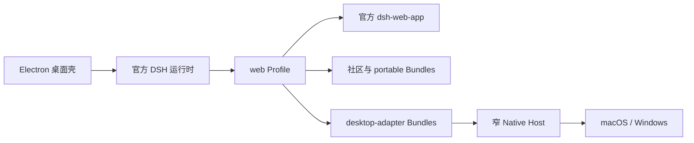
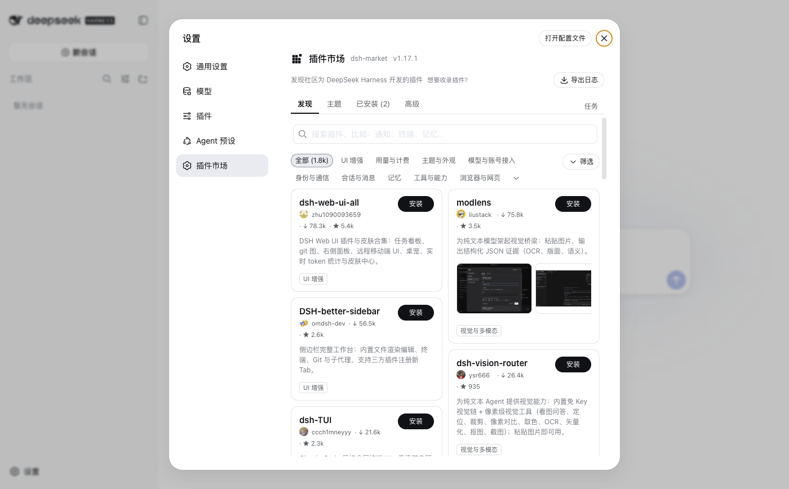
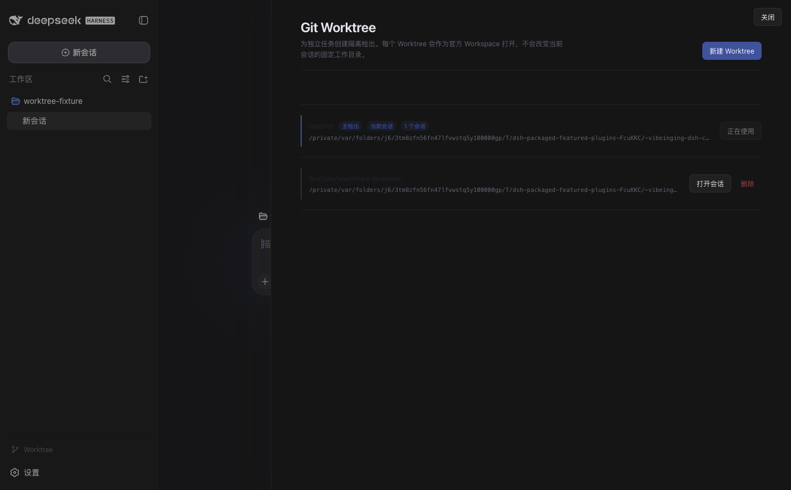

<h1 align="center">DSH Desktop</h1>

<p align="center">
  <strong>以官方 DSH Web 为核心的插件化桌面工作台。</strong><br>
  精选社区 Bundle、离线 Profile、Git Worktree、文件附件与受控原生能力，组合在一个 Electron 应用中。
</p>

<p align="center"><sub>独立的社区开源项目，与深度求索不存在隶属、合作、授权或背书关系。<br>中文 · <a href="README.en.md">English</a> · <a href="README.anime.md">二次元版 README</a></sub></p>

<p align="center">
  <a href="https://github.com/vibeinging/dsh-desktop"></a>
  <a href="LICENSE"></a>
  
  
  
</p>

<p align="center">
  
</p>

DSH Desktop 是社区维护的 Electron 发行版。它固定并运行官方 [DeepSeek Harness](https://github.com/deepseek-ai/deepseek-harness) npm 运行时，把 `dsh-web-app`、Session、Agent、Tool、Skill、MCP 与 Profile Bundle 组成可直接运行的本地桌面环境。项目不修改 DSH 源码，不另存一套插件状态，也不用私有 Chat 替换官方 Web。

这个仓库做的是“桌面发行层”：从社区中选择值得默认安装的 Bundle，固定它们的来源、版本、依赖、权限和许可，然后在真实 Profile 与 Electron 中验证安装、停用、卸载、重启和恢复。用户得到的不是一堆手工配置，而是一个可组合、可移除、可复现的 DSH 工作台。

## 我们坚持的桌面路线

| 原则 | 产品承诺 | 直接收益 |
| --- | --- | --- |
| 官方 Web 是唯一主界面 | 主窗口直接加载官方 Client 图，桌面能力也以 `dshClient` Bundle 加入 | 跟随 DSH 会话、设置与 Slot 演进，不等第二套界面重写 |
| Profile 是插件状态的唯一权威 | 市场、设置和 CLI 读写同一个 Profile；更新不补回用户已卸载的 Bundle | 不会出现“页面说已安装，DSH 实际没加载”的双状态 |
| 社区实现优先 | 任务看板、插件市场和附件输入直接采用独立社区 Bundle | 社区插件可同时服务官方 Web 与桌面发行版，不被锁在本项目里 |
| 默认组合可复现 | 新 Profile 从固定 tarball、SHA-256 和随包 pnpm 离线原子初始化 | 无需临时从 npm 拼装默认环境，安装失败不会留下半个 Profile |
| 原生能力按最小权限开放 | 窗口、文件、Browser Workspace 和更新只通过 Session 绑定的方法白名单暴露 | 第三方 Client 不能直接获取 Electron、Node 或通用 IPC |
| 失败必须可诊断、可恢复 | Profile 或 Client 启动失败时进入本地恢复页，保留原 Profile | 不用白屏、无限重启或静默改配置掩盖问题 |

这套路线适合想使用官方 DSH Web，同时需要社区插件、桌面原生能力、可控默认组合和清晰权限边界的用户与插件作者。

## 主要能力

<table>
  <tr>
    <td width="50%" valign="top">
      <h3>官方 DSH Web 桌面化</h3>
      <p>Electron 启动本地 DSH Web Profile，并管理窗口、服务启动、退出和恢复。主窗口直接加载官方 Client 图，不使用旧 Renderer 或产品 preload。</p>
    </td>
    <td width="50%" valign="top">
      <h3>默认插件市场</h3>
      <p><code>dshmarket@1.17.1</code> 挂在官方设置 Slot 内，提供发现、兼容性诊断、安装、更新和卸载。市场、设置页和命令行读写同一个 Profile。</p>
    </td>
  </tr>
  <tr>
    <td width="50%" valign="top">
      <h3>任务、附件与社区能力</h3>
      <p>社区 task-board 提供五列任务看板，附件 Bundle 在官方输入 Slot 中增加文件和文件夹选择，dshmarket 负责发现更多标准 Bundle。</p>
    </td>
    <td width="50%" valign="top">
      <h3>工作区与产出工具</h3>
      <p>Git Worktree、Project、Conversation、Canvas/Site、Structured UI、Office 和模型继承分属独立 Bundle。用户可按需移除，插件作者也可复用其中的 portable 能力。</p>
    </td>
  </tr>
  <tr>
    <td width="50%" valign="top">
      <h3>窄原生 Host</h3>
      <p>窗口、文件授权、Browser Workspace 和更新能力只通过方法白名单与 Session 绑定开放。第三方 Client 不能取得 Electron、Node 或通用 IPC。</p>
    </td>
    <td width="50%" valign="top">
      <h3>离线初始化与失败恢复</h3>
      <p>新 Profile 使用固定产物和随包 pnpm 原子初始化；已有 Profile 在更新时不被重写。启动失败进入恢复页，而不是显示白屏或静默补回用户已卸载的插件。</p>
    </td>
  </tr>
</table>

## 运行方式



官方 DSH 运行时负责 Agent、Session、Tool、Skill、MCP、Profile 和 Web UI。社区与 portable Bundle 只使用公开 DSH 服务，因此可安装到兼容的官方 Web Profile。`desktop-adapter` Bundle 才能调用桌面 Host，而且只能使用已声明、按 Session 绑定的有限方法。

这个分层使“在官方 Web 中可用”和“在 DSH Desktop 中可用”不再是两套插件体系：普通 UI、Tool 和工作流优先保持 portable，只有文件对话框、窗口或内置浏览器等操作系统能力需要桌面适配。

## 当前界面

### 官方会话、问题与审批


会话、问题卡片、工具审批、消息排队和历史回放都留在官方 Session 中。截图使用真实 DeepSeek-V4-Flash 对话；密钥只注入当次临时进程，不写入 Profile 或截图。

### 官方设置中的插件市场



在“设置 → 插件市场”中可以搜索、查看兼容性与权限，并对当前 Profile 执行安装、更新和卸载。市场是普通 Client Bundle，不替换官方设置容器。

### 官方 Workspace 中的 Git Worktree



Git Worktree Bundle 从当前 Session 的 `cwd` 识别主检出，在侧边栏和工作区中管理隔离 worktree，并为新工作区创建官方 Session。它只使用 DSH Workspace 与 Slot，可作为独立 portable Bundle 安装或移除。

## 开始使用

当前可从源码运行。仓库已固定官方 DSH npm 运行时和默认 Bundle，不需要另外 checkout 或修改 DSH 源码。

### 从源码运行

需要 Node.js 24 或更高版本：

```bash
git clone https://github.com/vibeinging/dsh-desktop.git
cd dsh-desktop
npm install
npm run doctor
npm run dev:electron
```

### 构建 macOS Apple Silicon App

```bash
npm run package:mac:dir
open "release/mac-arm64/DSH Desktop.app"
```

该命令生成本地未签名 App。正式 macOS 和 Windows 安装包会通过 GitHub Releases 发布。

## 插件生态

DSH Profile 是插件状态的唯一权威。新 Profile 通过官方 `dsh plugin --profile web` 原子安装默认 Bundle；已有 Profile 在应用更新时保持只读，不会补回、删除或重写用户选择。用户停用或卸载的 Bundle 在重启和升级后仍保持停用或卸载。

普通用户可以直接打开“设置 → 插件市场”。命令行使用同一套 Profile：

```bash
dsh plugin --profile web add -w <package>@<exact-version> --save-exact --ignore-scripts
dsh plugin --profile web remove <package>
```

新 Profile 默认安装固定的 `dshmarket@1.17.1`。发行包携带经过审查的固定 tarball、完整运行依赖闭包和 SHA-256；默认初始化不需要 npm 网络，也不执行上游生命周期脚本。浏览市场会访问社区目录，安装与更新可能访问 npm 或 GitHub；WebDAV 和 Gist 只有用户主动配置后才会使用。市场内展示的插件并不等于已经内置或通过发行审查。

新 Profile 也默认安装 `dsh-multimedia-webui-input@0.1.0`。它通过官方 `conversation.input.left`、`conversation.input.dock`、`conversation.input.overlay` 和 `settings.section` Slot 增加文件/文件夹选择按钮；文件只在发送时复制到当前 Session 工作区。官方 DSH 继续负责图片粘贴和拖拽，内置版去掉上游通用拖拽监听，防止图片被两条通道重复接收。它不修改官方 Chat，也不取得 Electron 或通用 IPC。与其他附件输入插件同时启用可能出现重复按钮或重复上传，默认 Profile 只保留这一套附件入口。

桌面侧的 `@vibeinging/dsh-desktop-profile-host` 只提供 `desktopProfiles` 和 `desktopPnpm` 两个公开结构服务。市场把用户确认的操作交给随包 pnpm 和官方 DSH CLI；它不能自行取得 Electron 权限或重启应用。

### 插件信任级别

| 级别 | 用户体验 | 发行版责任 |
| --- | --- | --- |
| 市场可发现 | 用户在市场中查看并主动安装 | 市场展示不等于本发行版审查、内置或背书 |
| 已记录候选 | 目录会显示兼容性、权限、冲突和已知阻塞 | 固定上游来源和审查结论，但不进入默认 Profile |
| 随包但可选 | 无网络也能从本地固定产物安装 | 保留许可证、哈希、依赖和安装/卸载证据 |
| 随包且默认 | 新 Profile 原子安装，用户仍可停用或卸载 | 在当前 DSH、源码 Profile、打包 Electron、断网启动和卸载恢复中逐项验证 |

这个分级把“社区里存在”、“可以自行安装”和“适合作为发行默认值”分开。新增默认 Bundle 不会被应用更新静默补到旧 Profile，已有用户始终保留自己的组合。

<details>
<summary>查看新 Profile 默认安装的 13 个 Bundle</summary>

<!-- featured-plugins:start -->
| 默认 Bundle | 类型 | 声明权限 | 官方管理方式 | 来源 |
|---|---|---|---|---|
| `@vibeinging/dsh-work-product-host-ipc` | desktop-adapter | dsh-work-parent-ipc、browser-workspace-host、file-dialog-host、window-host | 桌面基础服务，不提供卸载 | [本地包](packages/dsh-work-product-host-ipc) |
| `@vibeinging/dsh-desktop-profile-host` | desktop-adapter | dsh-profile-filesystem、controlled-pnpm-runtime、dsh-cli-runtime | 桌面基础服务，不提供卸载 | [本地包](packages/dsh-desktop-profile-host) |
| `@vibeinging/dsh-desktop-chrome` | desktop-adapter | 无 Host 权限 | `dsh plugin --profile web remove @vibeinging/dsh-desktop-chrome` | [本地包](packages/dsh-desktop-chrome) |
| `@vibeinging/dsh-project-tools` | desktop-adapter | product-host | `dsh plugin --profile web remove @vibeinging/dsh-project-tools` | [本地包](packages/dsh-project-tools) |
| `@vibeinging/dsh-canvas-tools` | desktop-adapter | product-host | `dsh plugin --profile web remove @vibeinging/dsh-canvas-tools` | [本地包](packages/dsh-canvas-tools) |
| `@vibeinging/dsh-structured-ui-tools` | desktop-adapter | product-host | `dsh plugin --profile web remove @vibeinging/dsh-structured-ui-tools` | [本地包](packages/dsh-structured-ui-tools) |
| `@vibeinging/dsh-model-inheritance` | portable | 无 Host 权限 | `dsh plugin --profile web remove @vibeinging/dsh-model-inheritance` | [本地包](packages/dsh-model-inheritance) |
| `@vibeinging/dsh-product-bridge` | desktop-adapter | product-host | `dsh plugin --profile web remove @vibeinging/dsh-product-bridge` | [本地包](packages/dsh-product-bridge) |
| `@vibeinging/dsh-office-tools` | desktop-adapter | office-artifact-host | `dsh plugin --profile web remove @vibeinging/dsh-office-tools` | [本地包](packages/dsh-office-tools) |
| `@vibeinging/dsh-client-ui-worktree` | portable | 无 Host 权限 | `dsh plugin --profile web remove @vibeinging/dsh-client-ui-worktree` | [本地包](packages/dsh-worktree) |
| `@linxin666/dsh-client-ui-task-board` | portable | 读取当前 DSH Session、Workspace 与完成历史、在 DSH_HOME 写入任务账本和执行记录、按用户操作或 Host cron 启动 DSH Session 任务、可选启动固定的跨平台防休眠 helper | `dsh plugin --profile web remove @linxin666/dsh-client-ui-task-board` | [上游仓库](https://github.com/zhu1090093659/dsh-web-ui) |
| `dsh-multimedia-webui-input` | portable | 读取用户主动选择的文件和文件夹、向当前 Session 工作区的 .dsh/tmp/attachments 写入附件、按用户二次确认清理带插件所有权标记的附件目录 | `dsh plugin --profile web remove dsh-multimedia-webui-input` | [上游仓库](https://github.com/LCYLYM/dsh-attachments) |
| `dshmarket` | portable | 读取和修改当前 DSH Profile 的依赖、Bundle 顺序和启停状态、通过受控 pnpm 安装、更新和卸载用户确认的插件、访问插件目录、npm、GitHub 以及用户配置的 WebDAV 或 Gist、导出或导入包含 Profile 配置的备份 | `dsh plugin --profile web remove dshmarket` | [上游仓库](https://github.com/dsh-market/dsh-market) |
<!-- featured-plugins:end -->

</details>

## 插件兼容性

DSH Desktop 按能力边界识别两类 Bundle：

- `portable` Bundle 只使用官方 DSH 服务，可以安装到兼容的官方 Web Profile；
- `desktop-adapter` Bundle 使用 DSH Desktop 提供的窄 Host 合同，离开桌面宿主时应直接报告缺少能力。

与当前官方 DSH Web 兼容的标准 Bundle 可通过市场或官方 CLI 安装，不需要为 DSH Desktop 重写。需要窗口、文件对话框或 Browser Workspace 的插件，则显式声明对桌面 Host 的依赖；能力缺失时直接报告，不伪装成可用。

插件作者可从 [`packages/`](packages/) 中的独立 Bundle 参考官方 Slot、Host 合同和打包方式。插件市场接入、权限和离线边界见[插件市场选择与桌面接入](docs/research/2026-08-22_dsh-plugin-market-selection.md)。

## 数据与安全

- Profile、Session 和本地运行数据默认保存在 `~/.dsh`；打开历史不会自动上传这些内容；
- 官方 Web `webContents` 没有产品 preload、Node 或通用 IPC；
- Profile 或 Client 启动失败时进入本地恢复页，不会白屏或静默修改原 Profile；
- 恢复页可以重试、启动只含官方 `base` 与 `web-app` 的安全 Profile、打开目录、确认后移除指定插件并导出过滤后的诊断；
- 项目代码、第三方 Bundle 和视觉资产分别遵守自己的许可证与再分发条件。

详见[隐私说明](PRIVACY.md)、[安全说明](SECURITY.md)和[第三方说明](THIRD_PARTY_NOTICES.md)。

## 与其他社区桌面发行版

[anywhere-labs/deepseek-harness-desktop](https://github.com/anywhere-labs/deepseek-harness-desktop) 和本项目都是独立社区发行版，但选择了不同的桌面路线。anywhere-labs 将桌面 Shell、托盘、终端、更新和跨平台安装器组成完整客户端；本项目固定官方 npm 运行时，以官方 Web 为唯一主界面，并把独立社区 Bundle、离线 Profile 产物和窄 Native Host 作为核心。

两者都不是 DeepSeek Harness 官方桌面端。这里不做“更官方”的暗示，只明确本项目的不变边界：官方 Web 单一界面、Profile 单一权威、社区插件优先、默认组合可复现、原生能力最小授权。源码级差异见 [两套社区桌面发行版对比](docs/research/2026-08-22_dsh-desktop-distribution-differences.md)。

## 相关项目

| 项目 | 关系 |
| --- | --- |
| [DeepSeek Harness](https://github.com/deepseek-ai/deepseek-harness) | 提供核心 Agent、Session、Tool、Skill、MCP、Profile 与官方 Web |
| [Cordis](https://github.com/cordiverse/cordis) | 提供插件化基础 |
| [dsh-market](https://github.com/dsh-market/dsh-market) | 当前默认内置的可视化插件市场 |
| [dsh-web-ui](https://github.com/zhu1090093659/dsh-web-ui) | 当前 task-board 的上游社区仓库 |
| [DSH Desktop by anywhere-labs](https://github.com/anywhere-labs/deepseek-harness-desktop) | 以完整桌面 Shell 和跨平台安装器为重心的独立社区发行版 |
| [dshfind](https://www.dshfind.com/zh) | DSH 学习、分享与插件发现社区 |

## 与 DeepSeek Harness 的关系

DSH Desktop 是基于 DeepSeek Harness 与 Cordis 插件思想构建的独立社区项目。上游提供核心运行时、插件系统和 Web UI；本项目负责 Electron 封装、新 Profile 的离线初始化、精选社区 Bundle、窄原生 Host、恢复页和桌面发行验证。

本项目与深度求索不存在隶属、合作、授权或背书关系。“DeepSeek Harness”仅用于真实、准确地说明兼容性和技术来源。

## 许可证

项目代码使用 [MIT License](LICENSE)。第三方组件、固定 tarball、原生二进制和视觉资产的来源与分发条件见 [THIRD_PARTY_NOTICES.md](THIRD_PARTY_NOTICES.md)。
